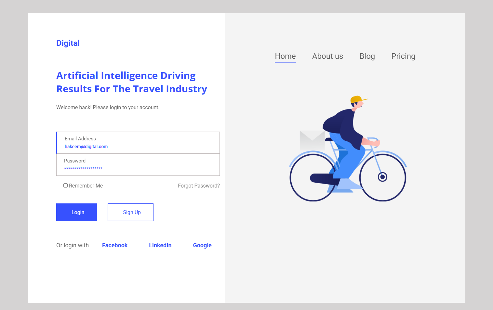

# Login Page

  
  
  
  

---

Este projeto foi desenvolvido como parte de uma atividade acadêmica, com o objetivo de aplicar os conhecimentos iniciais em **HTML** e **CSS**. Trata-se de uma página de login estática, criada com base em um layout disponibilizado pelo professor por meio do Figma.

> 🔰 Este foi meu primeiro contato com desenvolvimento web, e por isso, o projeto foi feito exclusivamente para **resolução de tela desktop**.

## 🔗 Links

- 🔍 [Acesse o projeto publicado](https://login-page-ruddy-iota.vercel.app/)
- 🎨 [Layout no Figma](https://www.figma.com/design/1tczoOyrzE37bWfMUDtGDm/Login-Page--Community-?node-id=0-1&p=f&t=L0hxbPGfIIFXtv8z-0)

## 📌 Observações

- O layout foi implementado com foco em **experiência desktop**, sem suporte para dispositivos móveis.
- Projeto desenvolvido durante as aulas de introdução ao desenvolvimento web na faculdade.

---

## 🧑‍💻 Desenvolvido com dedicação por [Eduardox64](https://github.com/Eduardox64)
